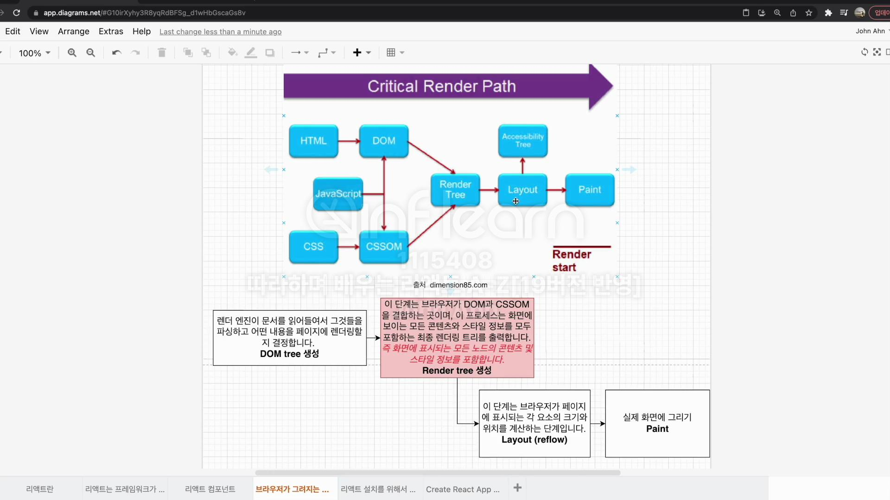
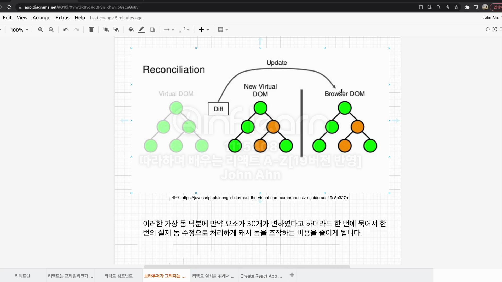
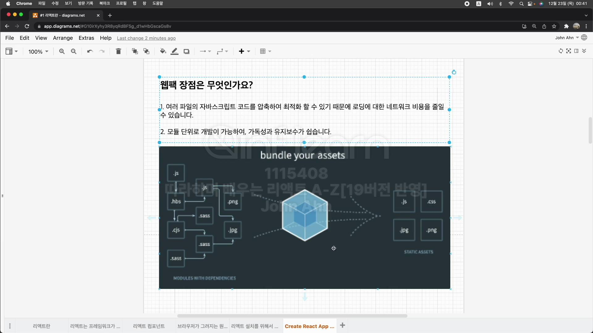

# Section2 리액트란

## 리액트는 프레임워크가 아닌 라이브러리

인터렉션이 많은 웹 앱을 개발하기 위해 주로 사용
프레임 워크와 라이브러리의 차이는?

프레임 워크는 어떠한 앱을 만들때 대부분의 것을 가지고 있는 것
라이브러리는 어떠한 특정 기능을 모듈화 해둔 것

## 리액트 컴포넌트

### 리액트 컴포넌트 두가지?

원래 클래스 컴포넌트를 많이 사용하였지만 훅이 등장한 이후 함수형 컴포넌트를 많이 씀.

1. 클래스형 컴포넌트

```js
class App extends Component {
  render() {
    return <h1>안녕하세요.</h1>;
  }
}
```

2. 함수형 컴포넌트

```js
function App() {
  return <h1>안녕하세요.</h1>;
}
```

## 브라우저가 그려지는 원리와 가상돔

### 웹페이지 빌드 과정(Critical Rendering Path CRP)

브라우저가 서버에서 페이지에 대한 HTML 응답을 받고 화면에 표시하기 전 여러단계가 있음.

웹 브라우저가 HTML 문서를 읽고, 스타일 입히고, 뷰포트에 표시하는 과정

#### DOM tree 생성

렌더 엔진이 문서를 읽어들여서 그것들을 파싱하고 어떤 내용을 페이지에 렌더링할지 결정합니다.

#### Render tree 생성

DOM과 CSSOM을 결합.
화면에 보이는 모든 콘텐츠와 스타일 정보를 모두 포함하는 최종 렌더링 트리를 출력.

#### Layout(reflow)

브라우저가 페이지에 표시되는 각 요소의 크기와 위치를 계산하는 단계

#### Paint

실제 화면에 그리기



#### 문제점

인터렉션에 의해 DOM에 변화가 생기면 그때마다 Render Tree가 재생성됨.

즉 모든 요소들의 스타일을 다시 계산.
인터렉션이 어어엄청 많다면?

DOM조작 비용이 크게 발생
이런 문제로 인해 나온 것!

#### 가상 돔 Virtual Dom

실제 DOM을 메모리에 복사해준것.
이전 가상돔과 비교해 바뀐 부분만 실제 돔에 적용

#### 관련 용어

##### Diffing

이전 돔과 바뀐 부분 찾는 과정을

##### Reconciliation(재조정)

바뀐 부분만 실제 돔에 적용시켜주는 것을


## 리액트 설치를 위해서 필요한 것들(Node.js & Visual Studio Code)

### Node.js

크롬 V8 자바스크립트 엔진으로 빌드한 자바스크립트 런타임으로서, 웹브라우저 환경이 아닌 곳에서도 자바스크립트를 사용하여 연산할 수 있음.

## Create React App 을 이용해서 리액트 설치하기

```
npx create-react-app <폴더 이름>
```

### 웹팩

오픈 소스 자바스크립트 모듈 번들러
여러개로 나누어져 있는 파일들을 하나의 자바스크립트 코드로 압축하고 최적화하는 라이브러리
로딩에 대한 네트워크 비용을 줄일수 있다.
모듈 단위로 개발이 가능해 가독성과 유지보수가 쉽다.



### 바벨

최신 자바스크립트 문법을 지원하지 않는 브라우저들을 위해 최신 자바스크립트 문법을 구형 브라우저에서도 돌 수 있게 변환 시켜주는 라이브러리

```js
// Babel Input:ES6(ES2015) arrow function
[1, 2, 3].map((n) => n + 1);

// Babel Outout:ES5 equivalent
[1, 2, 3].map(function (n) {
  return n + 1;
});
```

원래는 웹팩이나 바벨 별도로 설치를 해줘야 하는데

Create-React-App에는 이미 설정이 다 되어있다~
