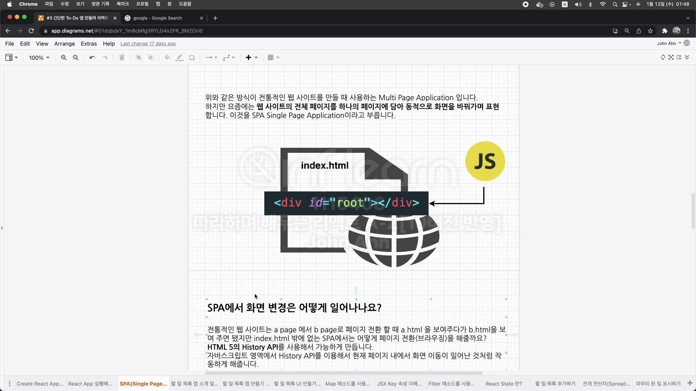
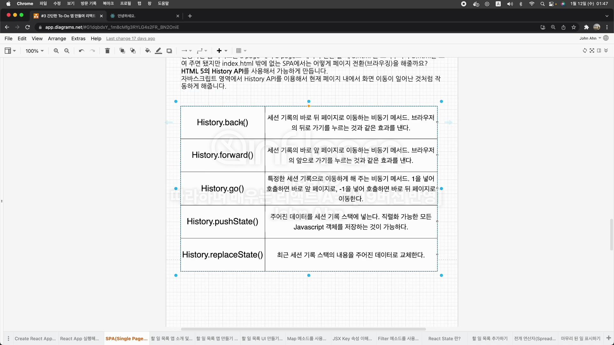
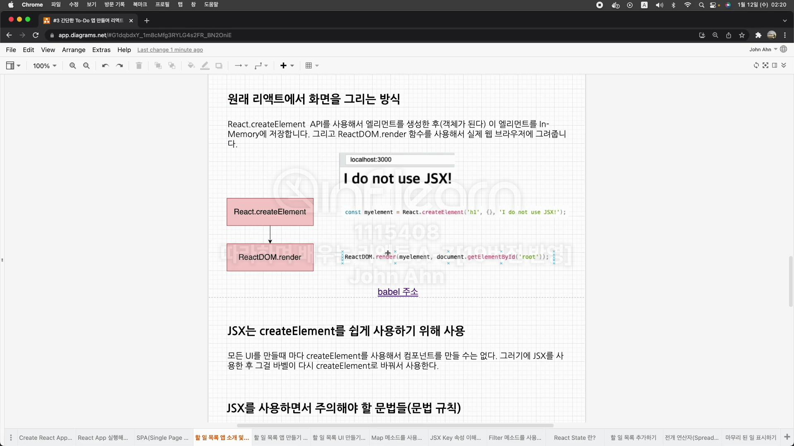

# section3 간단한 To-Do 앱 만들며 리액트 클래스형 컴포넌트 익히기

## SPA란?

웹사이트 전체 페이지를 하나의 페이지에 담아 동적으로 화면을 바꿔가며 표현한 것.

index.html밖에 없는 SPA에서 화면 변경은 어떻게 일어나요?

HTML 5의 History API를 사용해서 가능

자바스크립트 영역에서 History API를 이용해서 현재 페이지 내에서 화면 이동이 일어난 것처럼 작동하게 해줌

React-Router-Dom -> History API 사용

## History API

현재 페이지 내에서 화면 이동이 일어난 것 처럼 작동하게 해줌.

## JSX 알아보기 (Javascript syntax extension)

JSX는 자바스크립트의 확장 문법

**원래 리액트에서 화면을 그리는 방식**

React.createElement API를 사용해서 엘리먼트를 생성한 후(객체가 된다) 이 엘리먼트를 In-Memory에 저장합니다.

그리고 ReactDom.render 함수를 사용해서 실제 웹 브라우저에 그려줍니다.

**JSX는 createElement를 쉽게 사용하기 위해 사용**

모든 UI를 만들때마다 createElement를 사용해서 컴포넌트를 만들 수는 없다. 그래서 JSX를 사용한 후 그걸 바벨이 다시 createElement로 바꿔서 사용한다.

**JSX를 사용하면서 주의해야 할 문법들(문법 규칙)**

반드시 부모 요소 하나로 감싸줘야함.

**JSX Key 속성은 무엇인가?**

리액트에서 요소의 리스트를 나열할 때는 key를 넣어줘야 합니다.

키는 React가 변경, 추가 또는 제거된 항목을 식별하는 데 도움이 됩니다. 요소에 안정적인 ID를 부여하려면 배열 내부의 요소에 키를 제공해야 합니다.

**리액트는 가상 돔을 이용해서 바뀐 부분만 실제 돔에 적용!!!**

그렇다면 리스트를 나열할 때 바뀐부분만 찾으려면?

뒤에 추가 해줄때는 추가된 부분만 붙여주면 된다고 생각하지만 앞에 추가 할때는 리액트가 모든 요소가 새롭게 바뀐거라 생각하고 모두 새롭게 그리게 됨.

**Key에는 유니크한 값을 넣어줌.(index는 비추천)**

index도 0부터 시작해서 유니크한 값을 가지지만 만약 리스트가 추가되거나 제거되면 해당 리스트들의 key값도 바뀜.

**React State란**

컴포넌트의 렌더링 결과물에 영향을 주는 데이터를 갖고 있는 객체
