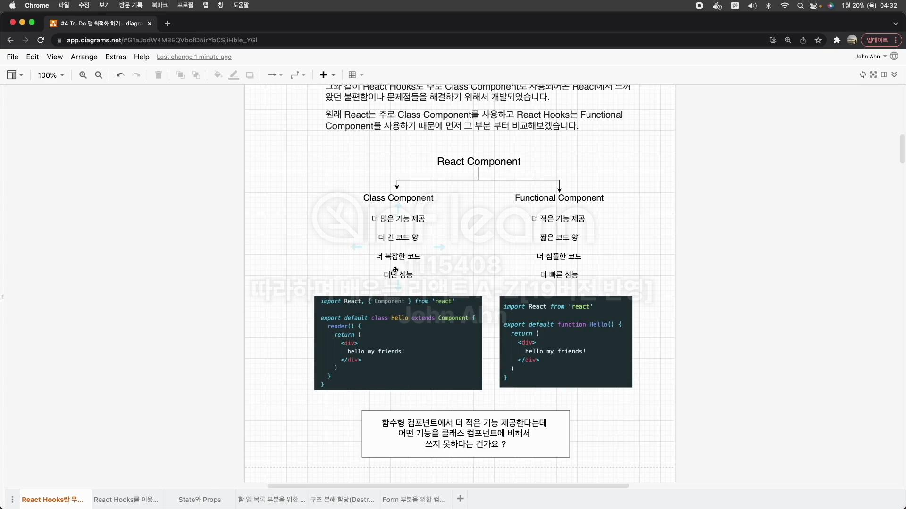
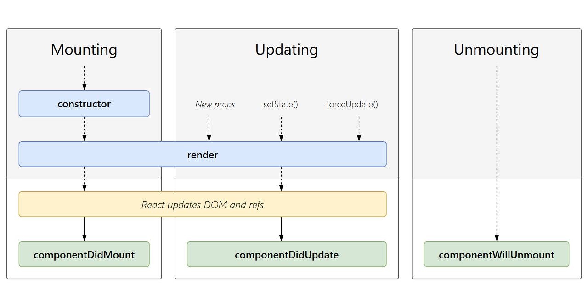
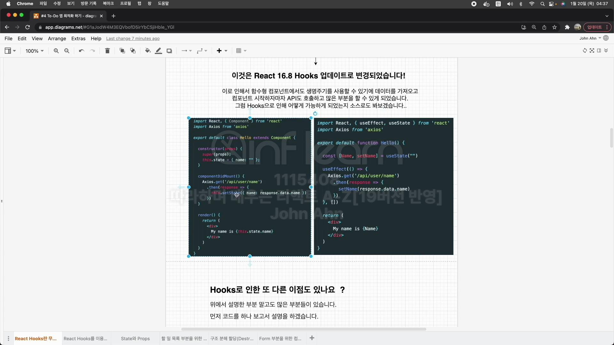
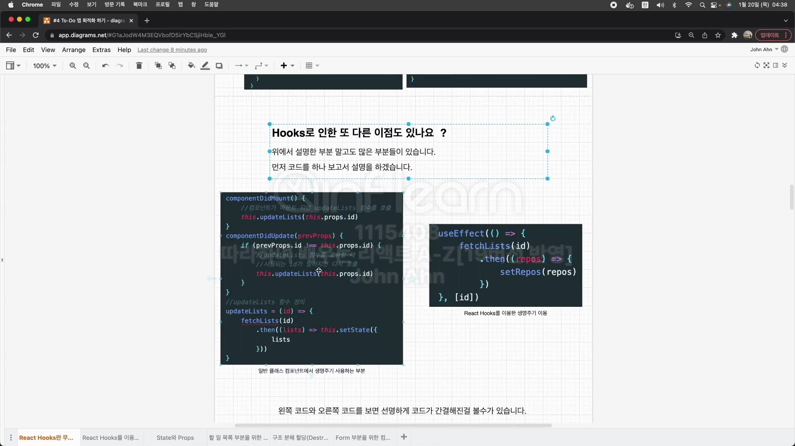
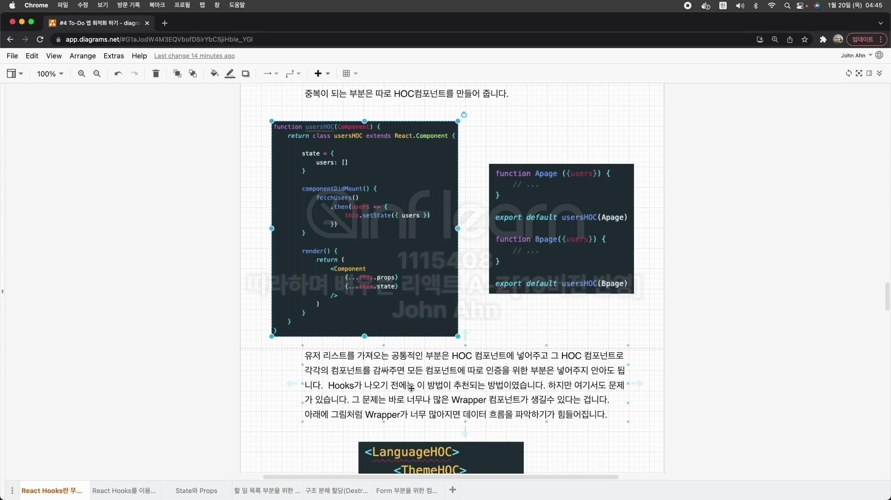
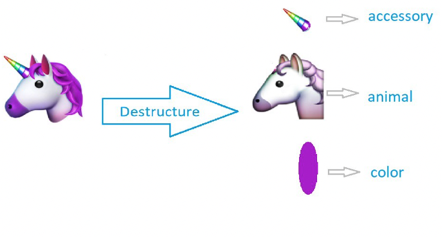

# section4 React Hooks란 무엇인가?

## React Hooks은 무엇인가?

React Hooks는 ReactConf2018에서 발표된, class없이 state를 사용할 수 있는 새로운 기능

## React Hooks이 필요한 이유?

Class Component로 사용되어온 React에서 느껴왔던 불편함이나 문제점을 해결하기 위해 개발됨.

원래 React는 주로 Class Component를 사용하고 React Hooks는 Functional Component를 사용하기 때문



## 함수형 컴포넌트에서 더 적은 기능을 제공한다는데 어떤 기능을 클래스 컴포넌트에 비해 못 쓴다는 건 가요?

**리액트의 생명주기**



이렇게나 중요한 생명주기를 함수형 컴포넌트에서는 사용을 못했기 때문에 함수형 컴포넌트가 더 간결하고 빠르더라도 클래스형 컴포넌트를 써옴.

### React 16.8 Hooks 업데이트로 변경되었습니다!



### Hooks로 인한 또 다른 이점.



리액트 훅을 사용할 때는 useEffect 안에서 다 처리 가능

### Hook로 인한 장점 하나 더

HOC 컴포넌트를 Custom React Hooks로 대체해서 너무나 많은 Wrapper 컴포넌트를 줄이게됨.

**HOC(Higher Order Component)란?**
화면에서 재사용 가능한 로직만을 분리해서 component로 만들고, 재사용 불가능한 UI와 같은 다른 부분들을 parameter로 받아서 처리하는 방법



```js
<LanguageHOC>
  <ThemeHOC>
    <AuthHOC>
      <Apage />
    </AuthHOC>
  </ThemeHOC>
</LanguageHOC>
```

## Hooks 관련 문제들

**1. HOC란 무엇인가요?**
Higher Order Component의 약자로 컴포넌트를 인자로 받아서 새로운 리액트 컴포넌트를 리턴하는 함수

**2. 너무나 많은 HOC를 사용하게 되면 Wrapper가 너무 많아지게 됩니다. 그걸 Hooks에서는 어떻게 처리하나요?**
React Hooks에서는 HOC대신에 따로 Custom Hooks를 이용해서 컴포넌트를 만들어서 처리를 해줍니다. 그로인해 Wrapper가 많아지는 일을 방지할 수 있습니다.

**3. 생명주기를 위해서 Hooks에서는 어떠한 api를 사용하나요 ?**
componentDidMount, componentDisUpdate, componentWillUnmount 모두를 Hooks에서는 useEffect를 이용해서 처리해줍니다.

**4. Hooks에서 state을 업데이트 해주려면 어떻게 해야 하나요?**
state을 정의해줄 때 const [name, setName] = useState("");이런식으로 해줍니다. 여기서 setName을 이용해서 state을 업데이트 시켜줄 수 있습니다.

## state와 props

props

1. props는 Properties의 줄임말.
2. props는 상속하는 부모 컴포넌트로부터 자녀 컴포넌트에 데이터 등을 전달하는 방법
3. props는 읽기 전용(immutable)으로 자녀 컴포넌트 입장에서는 변하지 않는다.
   (변하게 하고자 하면 부모 컴포넌트에서 state를 변경 시켜줘야 한다.)

```js
<ChatMessages
    messages={messages}
    currentMember={member}>
```

state

1. 부모 컴포넌트에서 자녀 컴포넌트로 내보내는 게 아닌 해당 컴포넌트 내부에서 데이터를 전달하려면 state로
2. state는 변경 가능(mutable)
3. state가 변하면 re-render 된다.

```js
const [message, setMessage] = useState("");
```

## 구조 분해 할당(Destructuring)

구조 분해 할당이란? (ES6)
배열이나 객체의 속성을 해제하여 그 값을 개별 변수에 담을 수 있게 하는 Javascript 표현식



응용

```js
const numbers = [1, 2, 3, 4, 5, 6];
const [,,three,,five] = numbers;

const studentDeatils = {
    firstName: 'John'
}
const {firstName: fName } = studentDeatils;
console.log(fName;)
```

고급 응용

```js
let people = [
  {
    name: "jirung",
    //생략
    family: {
      father: "smith",
      //생략
    },
  },
  //생략
];
for (let {
  name: n,
  family: { father: f },
} of people) {
  console.log("Name: " + n + ", Father: " + f);
}
```

## 참조 - 리액트 모듈 설치 시 나는 종속성(dependency) 에러 해결 방법

리액트18 버전에서 라이브러리들을 설치할 때
종속성에 관한 에러가 날 때가 많이 있습니다.

npm ERR! code ERESOLVE
npm ERR! ERESOLVE unable to resolve dependency tree
npm ERR! Found: react@18.1.0
npm ERR! node_modules/react
npm ERR! react@"^18.1.0" from the root project
npm ERR! Could not resolve dependency:
npm ERR! peer react@"^17.0.1" from react-dnd...

[원인]

unable to resolve dependency tree
리액트 18 버전 라이브러리와 설치하려는 해당 라이브러리의 종속성이 안 맞기 때문입니다.

[해결 방법]
이럴 때는 여러가지 해결방법이 있는데
첫 번째는 리액트 버전을 17로 낮추는 것인데 별로 좋은 방법은 아닙니다.
다른 방법은 npm 대신에 yarn을 이용해서 yarn install로 종속성을 설치해주는 방법입니다.
만약 yarn으로도 설치해도 안된다면 npm의 강제 설치 옵션으로 설치

--legacy-peer-deps : 기존 버전 다 무시하고 일단 설치.
--force : package-lock.json에 몇가지의 다른 의존 버전들을 추가하면서 설치.

## TailWindCss란 무엇인가요?

HTML 안에서, css 스타일을 만들 수 있게 해주는 CSS 프레임 워크 입니다.

### CSS 프레임 워크는 무엇인가요?

CSS 프레임 워크는 레이아웃 및 여러 컴포넌트 구성, 브라우저 호환성을 보장하는데 소요되는 시간을 최소화하기 위해 여러 웹 개발/디자인 프로젝트에 적용할 수 있는 CSS 파일 모음입니다.
더 빠르게 애플리케이션을 스타일링 하는데 도움을 줍니다.

**CSS FRAMEWORK 종류 for React JS**

1. Material UI
2. React Bootstrap
3. Semantic UI
4. Ant Design
5. Materialize
   ...

### Tailwind CSS의 장점

Tailwind CSS는 부트 스트랩과 비슷하게 m-1, flex와 같이 미리 세팅된 Uitility Class를 활용하는 방식으로 HTML에서 스타일링을 할 수 있다.

1. 그러기에 빠른 스타일링 작업이 가능하며

2. class 혹은 id 명을 작성하기 위한 고생을 하지 않아도 된다.
3. 유틸리티 클래스가 익숙해지는 시간이 필요할 수 있지만 IntelliSense 플러그인이 제공되서 금방 익숙해질 수 있다.

설치 명령어

npm i taillwindcss postcss autoprefixer

tailwind 초기 세팅 파일 설치 명령어

npx tailwindcss init
