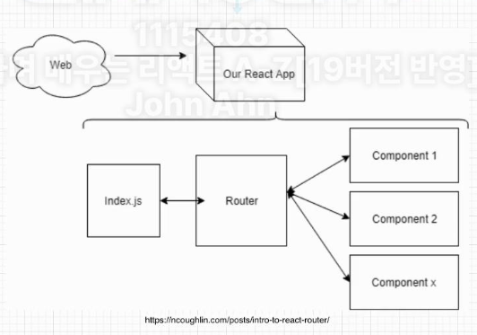

# Axios란 무엇인가?

- Axios는 브라우저, Node.js를 위한 Promise API를 활용하는 HTTP 비동기 통신 라이브러리입니다.
- 쉽게 말해서 백엔드랑 프론트엔드랑 통신을 쉽게하기 위해 Ajax와 더불어 사용합니다.

## 설치

- npm i axios --save

# Styled Component란?

Styled Component란 Css-in-Js라고 하는 Javascript파일 안에서 CSS를 처리 할 수 있게 해주는 대표적 라이브러리

https://styled-components.com/docs

## 설치 방법

```
npm i --save styled-components
```

# Iframe

HTML inline Frame 요소이며 inline frame의 약자입니다.

효과적으로 **다른 HTML 페이지를 현재 페이지에 포함**시키는 중첩된 브라우저로
iframe 요소를 이용하면 해당 웹 페이지 안에 어떠한 제한 없이 다른 페이지를 불러와서 삽입할 수 있습니다.

# React Router Dom

React Router DOM을 사용하면 웹 앱에서 동적 라우팅을 구현할 수 있습니다. 라우팅이 실행 중인 앱 외부의 구성에서 처리되는 기존 라우팅 아키텍처와 달리 React Router DOM은 앱 및 플랫폼의 요구 사항에 따라 컴포넌트 기반 라우팅을 용이하게 합니다.

# Single Page Application(SPA)

리액트는 SPA이기 때문에 하나의 index.html 템플릿 파일을 가지고 있습니다.
이 하나의 템플릿에 자바스크립트를 이용해서 다른 컴포넌트를 이 index.html 템플릿에 넣으므로 페이지를 변경해주게 됩니다. 이 때 이 React Router Dom라이브러리가 새 컴포넌트로 라우팅/탐색을 하고 렌더링하는데 도움을 주게 됩니다.


# React Router dom API

## 중첩 라우팅(Nested Routes)

React Router의 가장 강력한 기능 중 하나

### BrowserRouter

HTML5 History API(pushState, replaceState 및 popstate 이벤트)를 사용하여 UI를
URL과 동기화된 상태로 유지해줍니다.

### BrowserRouter로 루트 컴포넌트 감싸주기

```js
ReactDOM.render(
  <BrowserRouter>
    <App />
  </BrowserRouter>
);
```

## 여러 컴포넌트 생성 및 라우트 정의하기

```js
<BrowserRouter>
  <Routes>
    <Route path='/' element={<App />} />
    <Route index element={<Home />} />
    <Route path='teams' element={<Home />} />
    <Route path=':teamId' element={<Home />} />
  </Routes>
</BrowserRouter>
```

### Routes

앱에서 생성될 모든 개별 경로에 대한 컨테이너/상위 역할을 합니다.
Router로 생성된 자식 컴포넌트 중에서 매칭되는 첫번째 Route를 렌더링 해줍니다.

### Route

Route는 단일 경로를 만드는 데 사용됩니다. 두 가지 속성을 취합니다.

path는 원하는 컴포넌트의 URL 경로를 지정
element 경로에 맞게가 렌더링되어야 하는 컴포넌트를 지정

## <Link />를 이용해 경로를 이동하기

```js
function Home() {
  return (
    <div>
      <h1>
        <Link to='/about'>About 페이지를 보여주기</Link>
      </h1>
    </div>
  );
}
```

Link 구성 요소는 HTML 앵커요소와 유사

## Outlet

자식 경로 요소를 렌더링하려면 부모 경로 요소에서 사용해야함.
사용시 하위 경로가 렌더링될 때 중첨된 UI가 표시될 수 있습니다.
부모 라우트가 정확히 일치하면 자식인덱스 라우트를 렌더링하거나 인덱스 라우트가 없으면 아무것도 렌더링하지 않습니다.
react-router-dom에서 가져와서 사용.

```js
function App() {
  return (
    <div>
      <nav>
        <Link to='/'>Home</Link>
        <Link to='teams'>Teams</Link>
      </nav>
      <div className='content'>
        <Outlet />
      </div>
    </div>
  );
}
```

## useNavigate

경로를 바꿔줍니다. navigate('/home') ===> localhost:3000/home으로 갑니다.

```js
import { useNavigate } from "react-router-dom";

function SignupForm() {
  let navigate = useNavigate();

  async function handleSubmit(event) {
    event.preventDefault();
    await submitForm(event.target);
    navigate("../success", { replace: true});
  }

  return <form >
}
```

## useParams

style 문법을 path 경로에 사용하였다면 useParams()로 읽을 수 있습니다.
아래는 :invoiceId가 무엇인지 알기 위해 useParams를 사용

```js
import { Routes, Route, useParams } from "react-router-dom";

function App() {
  return (
    <Routes>
      <Route path='invoices/:invoiceId' element={<Invoice />} />
    </Routes>
  );
}

function Invoice() {
  let params = useParams();
  return <h1>Invoice {params.invoiceId}</h1>;
}
```

## useLocation

이 Hooks는 현재 위치 객체를 반환합니다.
이것은 현재 위치가 변경될 때마다 일부 side effect를 수행하려는 경우에 유용할 수 있습니다.

```js
import * as React from 'react;
import { useLocation } from 'react-router-dom';

fuction App() {
  let location = useLocation();

  React.useEffect(()=>{
    ga('send','pageview');
  },[location]);
}
```

## useRoutes

useRoutes Hooks는 와 <Routes>와 기능적으로 동일하지만 <Route> 요소 대신 JavaScript 객체를 사용하여
경로를 정의합니다.

이런 객체는 일반 <Route> 요소와 동일한 속성을 갖지만 JSX가 필요하지 않습니다.

```js
import * as React from "react";
import { useRoutes } from "react-router-dom";

function App() {
  let element = useRoutes([
    {
      path: "/",
      element: <Dashboard />,
      children: [
        {
          path: "messages",
          element: <DashboardMessages />,
        },
      ],
    },
  ]);
}
```

# Debounce가 무엇인가?

아래 그림을 보면 검색 입력에 입력할 때 입력 결과가 나타날 때까지 지연이 있습니다.

이 기능은 debounce 디바운스라는 function에 의해 제어됩니다.

debounce function은 사용자가 미리 결정된 시간 동안 타이핑을 멈출 때까지 keyup이벤트의 처리를 지연시킵니다.

이렇게 하면 UI 코드가 모든 이벤트를 처리할 필요가 없고 서버로 전송되는 API 호출 수도 크게 줄어듭니다.

입력된 모든 문자를 처리하면 성능이 저하되고 백엔드에 불필요한 로드가 추가될 수 있습니다.

## 모달 창 외부 클릭 시 모달 닫게 만드는 Custom Hooks 생성

어디를 클릭하는지 구분(모달 창 안 or 밖)

모달 창 바깥을 클릭하면 Callback 함수를 호출하는 Event를 등록해주기

Callback 함수 안에서 모달 닫아주기

useRef
특정 DOM을 선택할 때 사용하는 React Hooks입니다.

특정 DOM 선택하기

보통 Javascript에서는 getElementById, querySelector 같은 DOM Selector 함수를 사용해서 DOM을 선택

리액트에서는... ref라는 것을 이용해서 DOM을 선택

DOM을 직접 선택해야 할 경우들

1. 엘리먼트 크기를 가져와야 할 때
2. 스크롤바 위치를 가져와야 할 때
3. 엘리먼트에 포커스를 설정 해줘야 할 때 등등등

useRef()를 이용해서 Ref 객체를 만들고, 이 객체를 특정 DOM에 ref 값으로 설정합니다. 이렇게 되면 Ref 객체의 .current 값이 특정 DOM을 가리키게 됩니다.

```js
const ref = useRef();
<div ref={ref}></div>;
```

## swiper 모듈을 이용한 터치 슬라이드 구현하기
