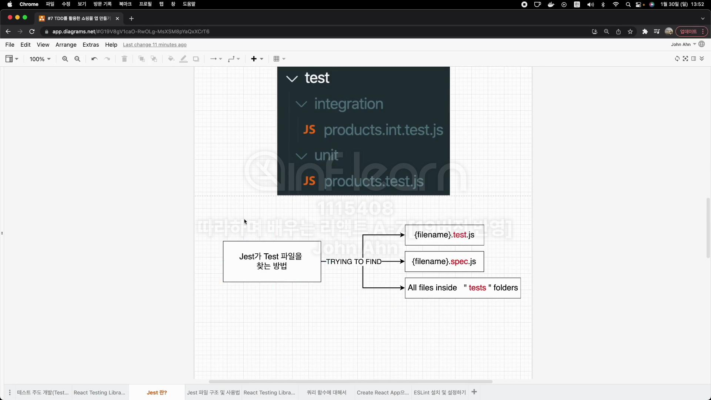
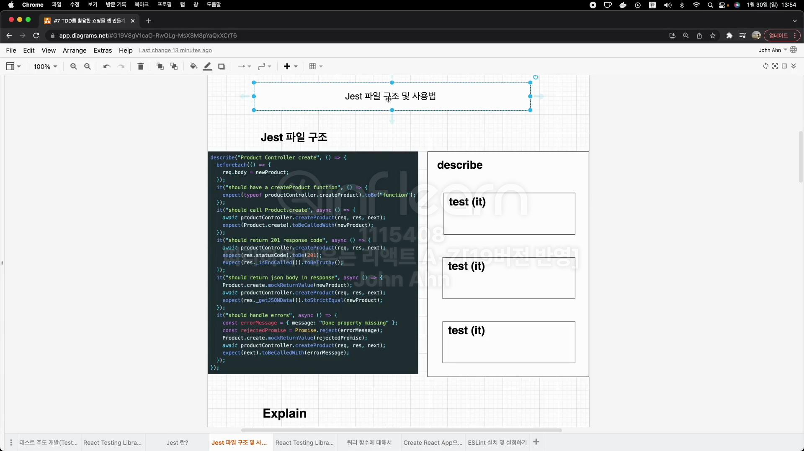
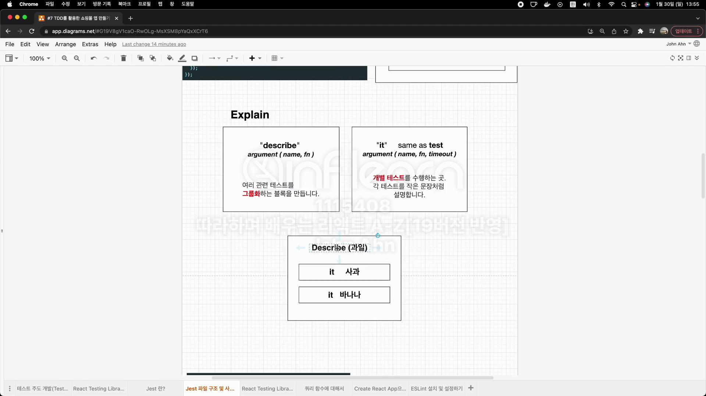
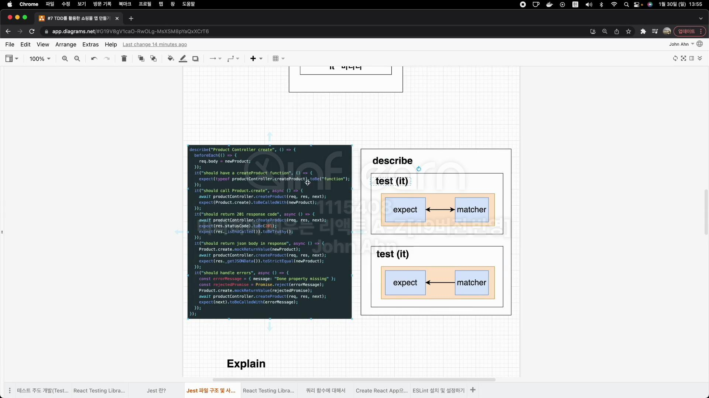
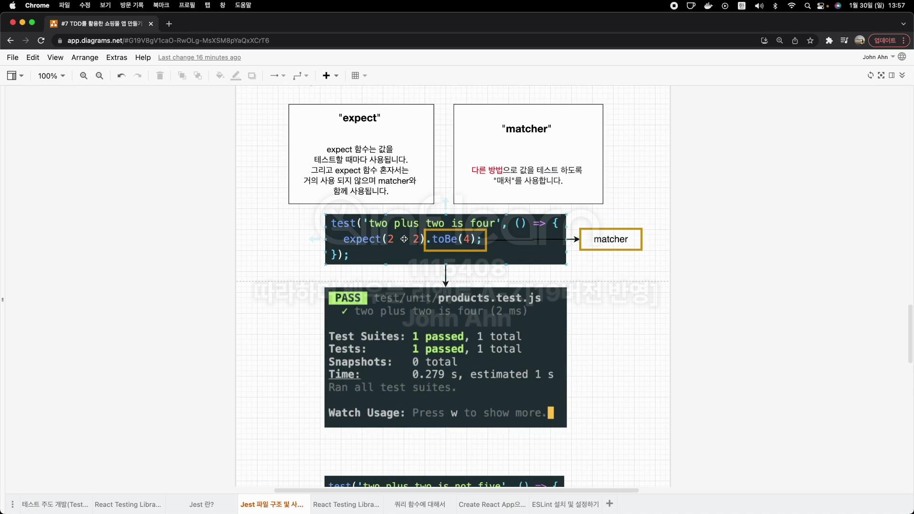
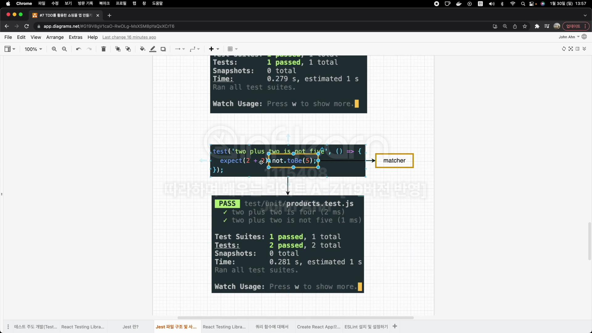
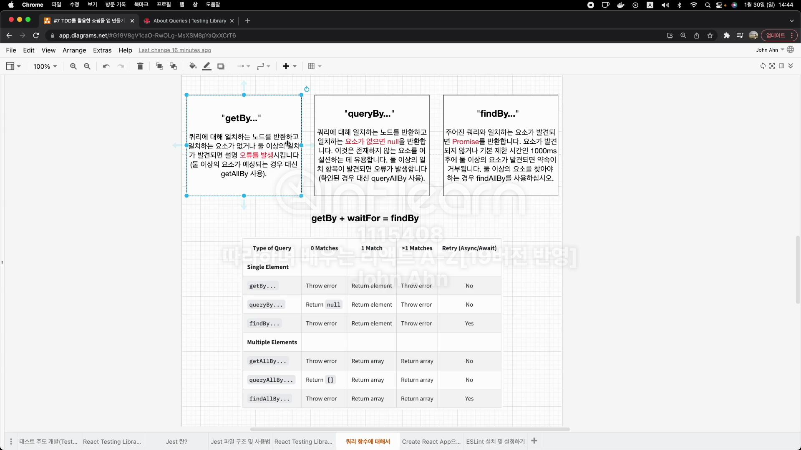

# Test Driven Development란 무엇인가요?

실제 코드를 작성하기 전에 테스트 코드를 먼저 작성합니다.
테스트 코드를 작성한 후 그 테스트 코드를 pass할 수 있는 실제 코드를 작성합니다.

1. 원하고자하는 기능의 테스트 코드 작성
2. 테스트 실행 Fail
3. 테스트 코드에 맞는 실제 코드 작성
4. 테스트 실행 Pass

## TDD를 하면 좋은점

1. TDD를 하므로 인해 많은 기능을 테스트하기에 소스 코드에 안정감이 부여된다.
2. 실제 개발하면서 많은 시간이 소요되는 부분은 디버깅 부분이기에 TDD를 사용하면 디버깅 시간이 줄어들고 실제 개발 시간도 줄어듭니다.
3. 소스 코드 하나하나를 더욱 신중하게 짤 수 있기 때문에 깨끗한 코드가 나올 확률이 높습니다.

## React Testing Library란?

Create React App로 리액트 앱을 생성하면 기본적으로 테스팅할 때 React Testing Library를 사용하는 것을 볼 수 있습니다.

React Testing Library는 React 구성 요소 작업을 위한 API를 추가하여 DOM Testing Library 위에 구축됩니다.

DOM Testing Library란 Dom 노드(Node)를 테스트하기 위한 매우 가벼운 솔루션입니다.

Create React App으로 생성된 프로젝트는 즉시 React Testing Library를 지원합니다.
그렇지 않은 경우 다음과 같이 npm 을 통해 추가할 수 있습니다.  
npm install --save-dev @testing-library/react

React Testing Library는 에어비앤비에서 만든 Enzyme을 대처하는 솔루션입니다.
Enzyme이 구성 요소의 구현 세부 정보를 테스트하는 대신 React Testing Library는 개발자를 React 애플리케이션의 사용자 입장에 둡니다.

Enzyme => 구현 주도 테스트(Implementation Driven Test)

React Testing Library => 행위 주도 테스트(Behavior Driven Test)

state 흐름(A Component) <= props 교환 => state 흐름(B Component)

**구현 주도 테스트**는 UI를 테스트할 때 태그가 바뀐 경우 같은 테스트가 주.
**행동 주도 테스트**는 사용자 입장으로 어떠한 이벤트를 발생시켰을 떄 화면이 어떻게 변화가 되는지 같은 테스트가 더 주를 이루게됩.

## Jest란 무엇인가요?

FaceBook에 의해서 만들어진 테스팅 프레임 워크.
최소한의 설정으로 동작. Test Case를 만들어서 어플리케이션 코드가 잘 돌아가는지 확인
단위(Unit)테스트를 위해서 이용

### Jest 시작하기

1. Jest 라이브러리 설치 npm i jest --save-dev
2. Test 스크립트 변경 "test":"jest" or "jest --watchAll
3. 테스트 작성할 폴더 및 파일 기본 구조 생성

Test

- 단위 테스트 폴더(Unit Test)
  - 단위 테스트 파일<대상 이름>.test.js
- 통합 테스트(Integration Test)
  - 통합 테스트<대상 이름>.test.init.js



### Jest 파일 구조 및 사용법











## React Testing Library 주요 API

```
npx create-react-app react-testing-app
```

```js
import { render, screen } from "@testing-library/react";
import App from "./App";

test("renders learn react link", () => {
  render(<App />);
  const linkElement = screen.getByText(/learn react/i);
  expect(linkElement).toBeInTheDocument();
});
```

## "render"함수

DOM에 컴포넌트를 렌더링하는 함수
인자로 렌더링할 React 컴포넌트가 들어감
Return은 RTL에서 제공하는 쿼리 함수와 기타 유틸리티 함수를 담고 있는 객체를 리턴(Destructuring 문법으로 원하는 쿼리 함수만 얻어올 수 있다.)
===> 소스 코드가 복잡해지면 비추천!!! screen객체를 사용하기
왜냐면 사용해야 할 쿼리가 많아질수록 코드가 복잡해질 수 있음

```js
test("renders learn react link", () => {
  const { getByTest } = render(<App />);
  const linkElement = getByText(/learn react/i);
  expect(linkElement).toBeInTheDocument();
});
```

## 쿼리 함수란

쿼리는 <span style="color:red">페이지에서 요소를 찾기 위해</span> 테스트 라이브러리가 제공하는 방법입니다.
여러 유형의 쿼리("get","find","query")가 있습니다. 이들 간의 차이점은 요소가 발견되지 않으면 쿼리에서 오류가 발생하는지 Promise를 반환하고 다시 시도하는 지 여부입니다. 선택하는 페이지 콘텐츠에 따라 다른 쿼리가 다소 적절할 수 있습니다.

```js
import { render, screen } from "@testing-library/react";

test("should show login from", () => {
  render(<Login />);
  const input = screen.getByLabelText("Username");
});
```



_waitFor_
일정 기간 동안 기다려야 할 때 waitFor를 사용하여 기대가 통과할 때까지 기다릴 수 있습니다.

## prettier 설치 및 설정

테스팅할 때 matcher를 알맞게 쓰는지 확신이 들지 않을때가 있으며, 코드의 형식이나 자바스크립트 문법 등을 올바르게 쓰지 못할 때가 있습니다. 그런 부분을 도와주는 모듈을 설치

### ESLint

개발자들이 특정한 규칙을 가지고 코드를 깔끔하게 짤수있게 도와주는 라이브러리
자바스크립트를 쓰는 가이드 라인 제시, 문법에 오류가 나면 알려주는 역할 등등
ESLint는 포맷터(formatter) 역할도 하지만 주요 기능은 문법 오류 잡는 것을

### Prettier

주로 코드 형식을 맞추는데 사용
작은 따옴표(')를 사용할지 큰 따옴표를 사용할지, Indent 값을 2로 줄지 4로 줄지등등, 에러 찾는 것이 아닌 코드 포맷터 역할.

Prettier는 코드 형식을 맞추는데 사용합니다.
테스팅을 위해 특화된 것은 아니지만 ESLint와 함께 자주 사용

Prettier설치

- npm 설치
  - 여러 개발자와 같은 포맷 유지에 더 좋음
- VSCODE 익스텐션으로도 가능
  - 혼자서 편하게 설치해서 사용하기 좋음

Plugins란 ?
eslint에서 기본으로 제공하지 않는 다양한 규칙을 플러그인을 통해 사용할 수 있습니다.
예를 들어 react에 관련된 린트설정을 위해서는 eslint-plugin-react-hooks를 사용하면 됩니다.
eslint-plugin-react-hooks를 사용하면 됩니다.

ESLint Testing Plugins 설치

```
npm install eslint-plugin-testing-library eslint-plugin-jest-dom
```

testing-library
render Dom 그리는 부분

jest-dom
expect-matcher로 테스트

내부 설정해주기

plugins 항목 : 플러그인 추가 (추가할 때, eslint-plugin- 부분 생략 가능)

extends 항목 : 플러그인을 추가한 후에 규칙을 정해줘야 사용 가능

vue, angular, react 중에 react를 위한 규칙 recommended는 추천이 되는 걸 사용

만약 규칙을 변경하고자 할 때는 rule 항목 추가

lint가 잘 작동하는 지 확인
