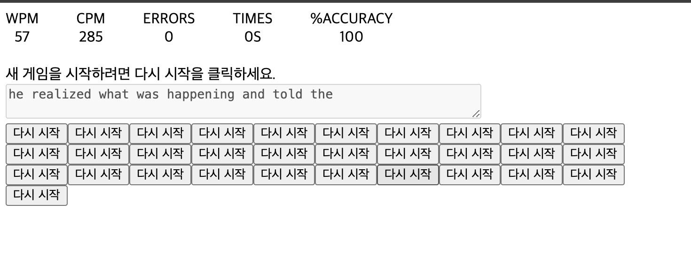

### 💡 단계로써 생각 세분화

**큰 틀에서 목적**: 바닐라 JS로 타이핑 테스트 앱 만들기

바로 구현할 수 있으면 BEST! 그렇지 않다면 아래 세부 단계로 드릴다운하여 _이해하지 못한 부분을 정확히 파악하기_

### 👩🏻‍💻 주요 기능

**게임 시작**

- 타자 입력시 TIME 20초 타이머 시작

**타자를 입력할 때마다**

- 제시된 문장과 타자 일치 여부 확인
  - 제시된 문자와 입력값이 일치할 경우 초록색 폰트 표시, 일치하지 않을 경우 빨간색 폰트와 밑줄 표시
- ERRORS 표시

  - 현재까지 입력된 모든 문자 대비 오답 문자 수

- ACCURACY 표시

  - 현재까지 입력된 모든 문자 대비 정답 비율
  - (입력한 문자 수 / 맞춘 문자 수) \* 100

- 제시된 문장 모두 입력시 다음 문장으로 이동

**게임 종료**

- TIME 20초의 시간 제한, 제시된 문장 모두 입력 완료

  - 제시된 문장 위치에 '새 게임을 시작하려면 다시 시작을 클릭하세요.'라는 메시지 표시
  - 다시 시작 버튼 생성
  - 결과 화면에 ERRORS, TIME, % ACCURACY, WPM(타자 속도), CPM(문자 입력 수) 표시

### 🐛 버그 히스토리

- typingArea클릭시 타이머 여러개 생기는 오류 수정
  - onClick 이벤트 발생시 이벤트 초기화 startGame 함수가 재호출 되지 않도록 함.
- 다시 시작시 결과 정보들이 초기화 되지 않는 오류 수정
  - 일부 초기화 되지 않은 값들 초기화 (totalError...등등)
- 게임 종료 후 재시작시 타이머 여러개 생기는 오류 수정
  - 다시 시작 버튼 클릭 이벤트 startGame 함수 제거
- 게임 종료시 타이머 종료 안되는 오류 수정
  - if (timer) {
    clearInterval(timer);
    timer = null; // 추가
    }
  - clearInterval시 타이머가 중지되는 함수지 timer를 null로 만들지 않아 if(timer)시 존재하여 타이머가 중지되지 않음. 꼭 null을 써줘야함.

### TODO

```
- 스타일 추가
```

### 회고

기능을 만드는데 급급했던 것 같다. 그로인해 다 만들었다고 생각했을 때 미처 고려하지 못한 부분들로 인해 생긴 버그 친구들🐛🐛🐛..
무한 타이머..다시 시작 버튼 무한 증식..등등

발생한 오류들을 수정하면서 어떤 부분들을 고려해야하는지 돌아보는 시간이 되었다.🤔


